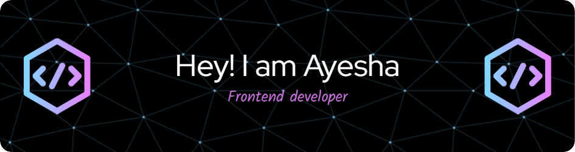

<h1 align="center">Hi 👋, I'm Ayesha</h1>
<h3 align="center">A passionate frontend developer from India</h3>

- 👨‍💻 All of my projects are available at [https://ayesha-zubair-portfolio.netlify.app/](https://ayesha-zubair-portfolio.netlify.app/)

- 📫 How to reach me **zk6891754@gmail.com**

<h3 align="left">Connect with me:</h3>

<h3 align="left">Languages and Tools:</h3>

         

